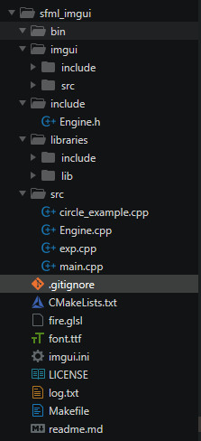

## Setup
### SFML
	Download the SFML Files from [SFML](https://www.sfml-dev.org/download.php)
	Copy the SFML folder from include to libraries/include
	Copy all .a file to libraries/lib
	Copy *.dll to bin folder

### IMGUI
	Clone [SFML-IMGUI Repo](https://github.com/eliasdaler/imgui-sfml)
	Copy *.h to imgui/include
	Copy *.cpp to imgui/src

**Your main.cpp file is located in src**

*Run* `$make `

>
